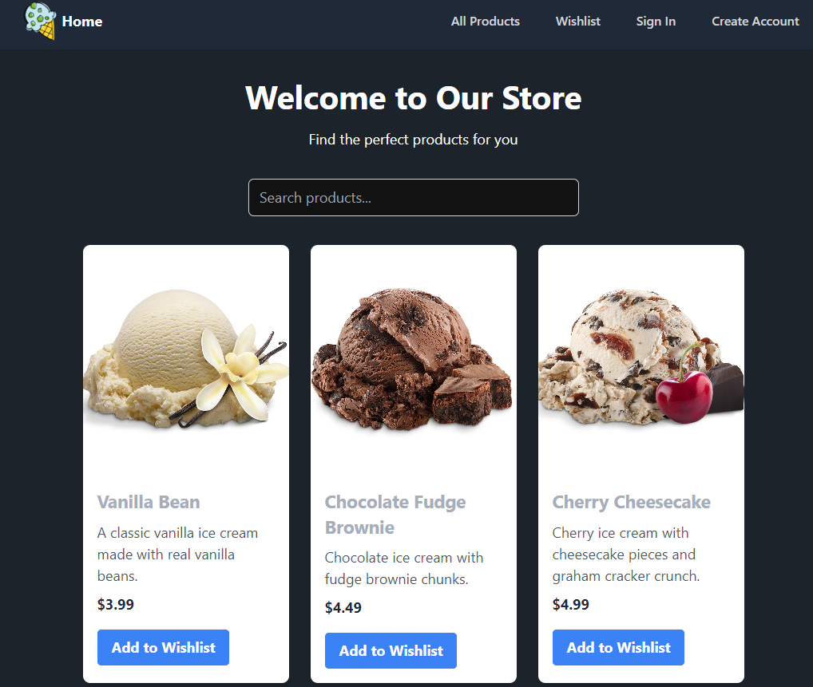

# My eCommerce App

**Live Demo**: [https://new-next-gray.vercel.app/](https://new-next-gray.vercel.app/)

## Summary

**My eCommerce App** is a web application built using **TypeScript**, the **NEXT.js framework**, and a **MongoDB database**, so make sure to do a good job as this will serve as a portfolio piece.

In this challenge, you are required to build a **client-server application** with the following details:

### Pages

* [x] Register Page
* [x] Login Page
* [x] Home Page

  * [x] Promo Banner
  * [x] Ecommerce Info Details
  * [x] Featured Products (5–10 products) + “see all”
* [x] Product Page
* [x] Product List

  * [x] Search Feature
  * [x] Pagination Feature (using infinite scroll)
  * [x] Add to Wishlist Feature
* [x] Product Detail Page

  * [x] Add to Wishlist Feature
  * [x] Meta Tag Implementation in Head according to product details
* [x] Wishlist Page

  * [x] Wishlist List
  * [x] Remove from Wishlist Feature

### Features

* [x] Register Feature
* [x] Login Feature
* [x] Show Product List Feature
* [x] Show Product Detail Feature
* [x] Add to Wishlist Feature
* [x] Remove from Wishlist Feature
* [x] Product Search by Name Feature (implemented with debounce)
* [x] Pagination Feature (implemented with infinite scroll)
